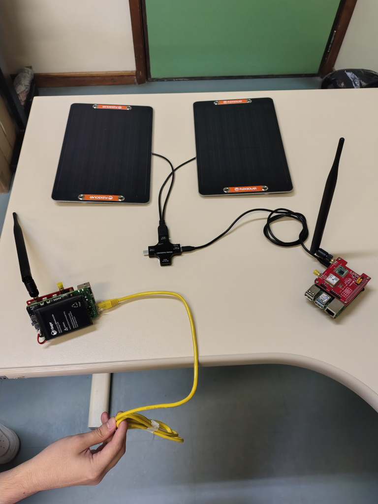
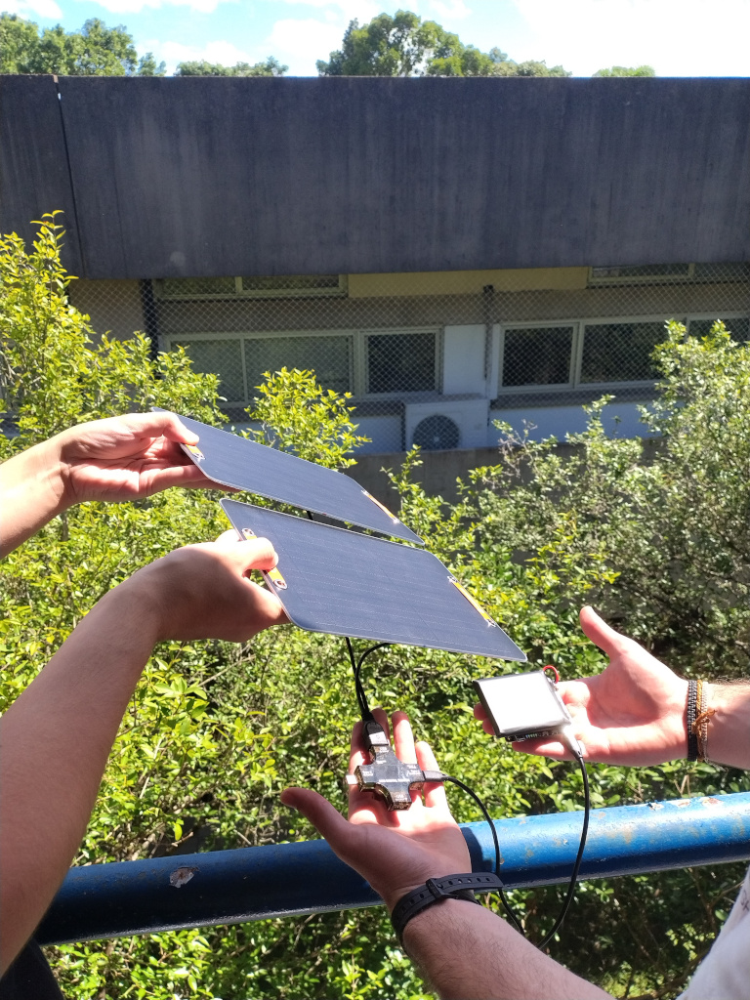
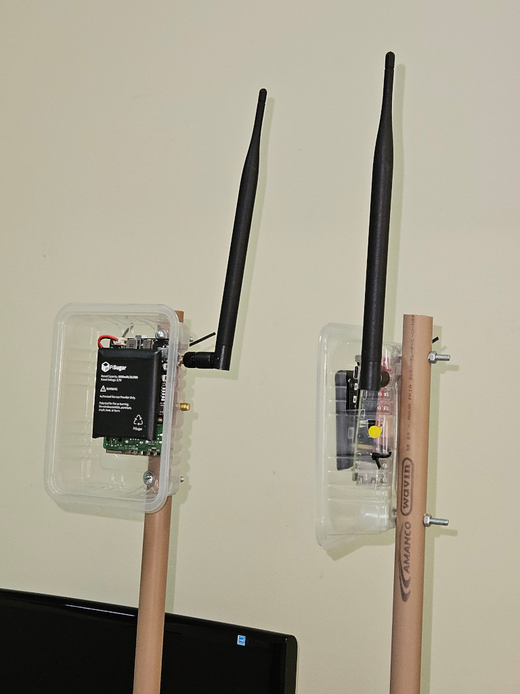
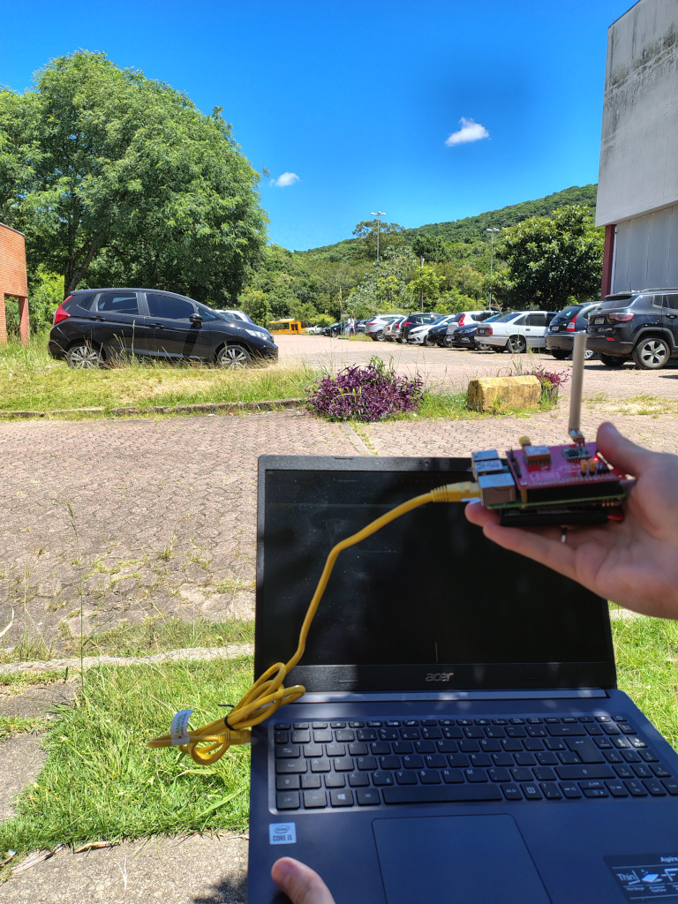
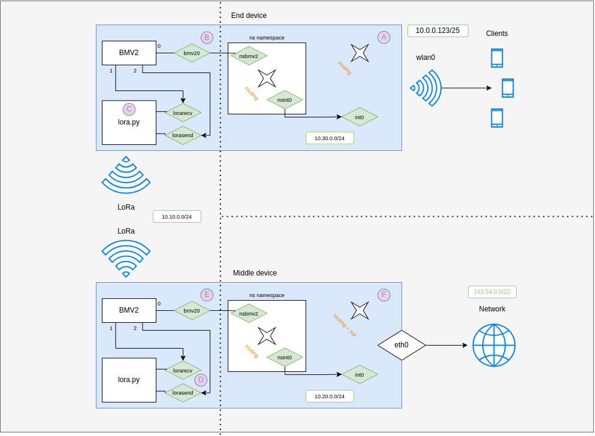

# Programmable_Low_End_Networks

## Introduction

This is the repo with the source code for the paper "Towards programmable low-end networking: Research challenges and lessons learned", accepted for publication in the 2025 IEEE/IFIP Network Operations and Management Symposium (NOMS 2025) [1]. In that paper, we mention that the research agenda on programmable data planes has been primarily focused on high-end networking devices, driven by technical requirements derived from operations & management needs of large scale datacenters and cloud providers. We also argue in favor of a yet incipient but equally paramount and challenging topic in this agenda: research on programmable low-end devices, like Low-power wide-area network (LPWAN). One main motivation is ``unlocking'' LPWAN, enabling one to freely redefine how they parse and process packets by means of Domain-specific languages such as P4. In addition to reducing capital expenditure by allowing interoperability between devices from multiple vendors, programmability would open LPWAN to an entire novel class of use cases, like providing inclusive internet access to technologically marginalized populations (such as rural communities). To contribute to this emerging research agenda, we propose a conceptual architecture and demonstrate the technical feasibility of a Programmable LPWAN by means of a proof-of-concept prototype, built using off-the-shelf hardware. More importantly, we present and discuss valuable lessons towards the design of such devices, maintaining their popular characteristics (like low power, low cost, long rage) yet freely (re)programmable for a broader class of novel use cases.

[1] V. B. Alves, M. Basso, L. B. Ramos, J. Guillemot, A. Riker, A. Abelém, L. Gaspary, M. F. Zhani, J. Galan-Jimenez, J. A. Wickboldt, and W. Cordeiro, "Towards programmable low-end networking: Research challenges and lessons learned," in 2025 IEEE/IFIP Network Operations and Management Symposium (NOMS 2025). IEEE/IFIP, 2025.

## Experiments for Demo Submission (IEEE/IFIP NOMS 2025 Demo Session)

Selected photos taken during the experimentation of our prototype for our submission to NOMS_Demo_Session 2025 - 38th IEEE/IFIP Network Operations and Management Symposium - Demo Session. Check the  folder for more details and photos about the Demo submission.

**Demo paper title:** Bringing Programmable Low-End Networks to Life: A Field Study with An Off-the-Shelf Prototype 

<table align="center">
<tr>
  <td></td>
  <td></td>
</tr>
<tr>
  <td></td>
  <td></td>
</tr>
</table>

## Pilot Project [Prototype]

In this document, we aim to explain what is the prototype we are developing; the tasks we already made and the ones that are to come.


_The image above describes the structure of the prototype we are building._


A more detailed version of the prototype is depicted below:


_The image shows the namespaces and the interfaces that are used for a functional communication._

<br/>

To build the network described above, we have to develop 2 important parts:

1. The communication through the [BMV2 software switch](https://github.com/p4lang/behavioral-model) using [P4](https://github.com/p4lang) on the [P4Pi OS](https://github.com/p4lang/p4pi).
2. The [LoRa SX127x](https://www.dragino.com/products/lora/item/106-lora-gps-hat.html) antennas communication using [scapy](https://scapy.net/) and some LoRa base codes.

The idea is that the communication with the network will occur passing through the programmable switch, and then, through the LoRa Radio transmissions, giving us the power to communicate over long distances. The speed of the radio link will be slow (something along the line of 400bps to 50Kbps), however, it will be enough to demonstrate the idea and make some experiments.
<br/>

We developed these parts separately, and so, now we have to merge these two technologies together.

<br/>

## Steps to integrate project parts
      
### merging projects
- [X] configure GPIO pins for LoRa
- [X] configure SPI on Raspberry Pi

    [link to the issue](https://github.com/mayeranalytics/pySX127x/issues/21) - Comment by Mike Routen made on Dec 5, 2018

    Enable SPI on Interface Options
    ```console
        sudo raspi-config
    ```

    1. "dtoverlay=spi0-cs,cs0_pin=25" at the end of `/boot/config.txt`
    2. clone the repo [pySX127x](https://github.com/mayeranalytics/pySX127x)
    3. Follow installation process
    4. Change the values described on the github Issue in SX127x/board_config
    5. Add the respective lines found on the github Issue to SX127x/constants.py
    6. Add the respective lines found on the github Issue to SX127x/LoRa.py
    7. Try and run sudo ./lora_util.py
        1. Assertion Error: Try and reboot the raspberry

### Other tasks
- [ ] create patch file
- [ ] organize experiments data (datasheet and folder)
- [ ] analyse gathered data

