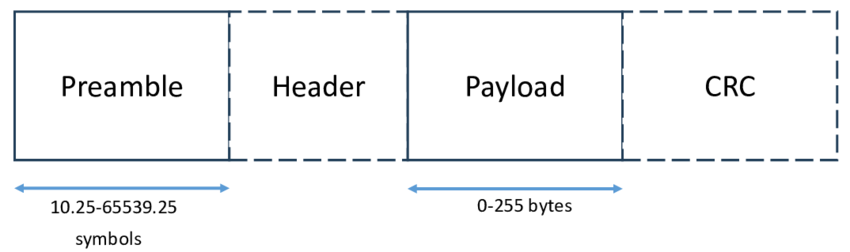

# LoRa Settings for PLEN

this page describes the LoRa settings used in the prototype presented.

## LoRa physical layer

The information found here is based of the [Sakshama Ghoslya blog](https://www.sghoslya.com/) post series on LoRa Technology, on the [LoRa official documentation](https://lora.readthedocs.io/en/latest/#range-vs-power) and other fonts that will be quoted when necessary. We also used the [LoRa Bitrate & Sensitivity Calculator](https://unsigned.io/understanding-lora-parameters/) to analyse our configurations.

<div style="text-align: center; margin: 32px auto;">



</div>

### Basic configurations

In order to maximize the throughput of our narrow link, using the [LoRa SX127x Raspberry Pi HAT by Dragino](https://www.dragino.com/downloads/downloads/LoRa-GPS-HAT/LoRa_GPS_HAT_UserManual_v1.0.pdf), along with the [Mayer Analytics python interface](https://github.com/mayeranalytics/pySX127x) we set the following configurations:

```text
# [6-12] (default 7) in Mayer Analytics library
spreading-factor: 7;
frequency: 868;

# 500 KHz
bandwith: 9;

# this in not an option, it has to be added in the library manually
coding-rate: 0;

preamble: 5; # default is 8
```

### Optimizations

The ideia of removing the CRC risks long-range communication reliability, however, for our lab environment tests, this configuration saves a lot of transmitting power and makes the transmission of packets a lot faster.

Also, beyond the removal of the `CRC` field, we also reduces the size of the `preamble`, from 8 to 5 symbols, which reduces the transmitting power too. However, these configurations have yet to be proven feasible in a real-world application, given the trade-off between throughput and range.
